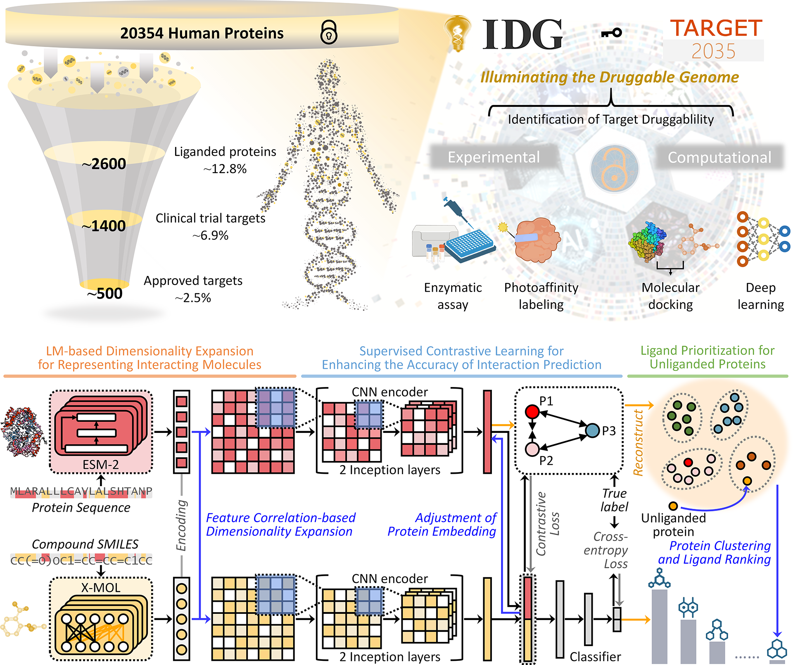

# iTarget-ImaCon



## Quick Start

```bash
git clone git@github.com:iTarget-AI/iTarget-ImaCon.git
cd ./iTarget-ImaCon

bash bashes/pull_external_assets.sh
bash bashes/setup_env.sh
bash Usage_Infer.sh
```

The demo input file is:

```text
./data/predict_data/infer/infer_prot-drug.csv
```

The inference results will be saved to:

```text
./data/predict_data/inference_results.csv
```

The Conda environment keeps the legacy name `iTarget`. The inference scripts activate it automatically.

If resource download or environment setup fails, see [Troubleshooting and Manual Installation](#troubleshooting-and-manual-installation).

## Workflow Guide

| Goal | Section |
| --- | --- |
| Run the default inference example with the shortest commands | [Quick Start](#quick-start) |
| Understand or modify the inference input, output, and uncertainty score | [Inference](#inference) |
| Reproduce the default training workflow | [Training and Reproduction](#training-and-reproduction) |
| Build custom feature maps/templates | [Advanced Customization](#advanced-customization) |
| Fix resource download or environment setup issues | [Troubleshooting and Manual Installation](#troubleshooting-and-manual-installation) |
| Check what each helper script does | [Script Reference](#script-reference) |

## Inference

The repository provides a pretrained `final_model` trained on ChEMBL data. By loading the model parameters from `./pretrained/iTarget_final_model/model.pth`, users can predict compound-protein interactions and obtain the corresponding uncertainty scores at the same time. The best uncertainty threshold is determined to be 0.185. We recommend that users refer to this optimal uncertainty threshold for compound selection when applying iTarget-ImaCon to predict OOD compounds.

### Input Format

Edit the following file:

```text
./data/predict_data/infer/infer_prot-drug.csv
```

Expected format:

| source | drugid | smiles | protid | sequence | label |
| --- | --- | --- | --- | --- | --- |
| infer | inferdrug_1 | O=C......cc1 | inferprot_1 | MAS......TDY | 1 |
| infer | inferdrug_2 | NS(......)s1 | inferprot_2 | MSS......SMS | 1 |

The `label` column is kept for compatibility with the data loader. For prediction-only samples, it can be filled with `1`.

### Run Inference

Run the complete inference workflow with:

```bash
bash Usage_Infer.sh
```

This command prepares prediction inputs, generates ESM-2/X-MOL features, loads the pretrained model, and writes prediction and uncertainty results.

Final results will be saved to:

```text
./data/predict_data/inference_results.csv
```

## Training and Reproduction

This section is only needed if you want to reproduce training or train iTarget-ImaCon on benchmark/custom data. If you only want to use the pretrained model for inference, you can skip this section.

The default training/reproduction workflow uses the provided fitted maps directly. Custom map construction is not required for the default workflow.

Provided fitted maps:

```text
./data/processed_data/xmol_fitted.mp
./data/processed_data/esm2_fitted.mp
```

### 1. Generate Protein and Compound Feature Encodings

iTarget-ImaCon uses ESM-2 for proteins and X-MOL for compounds.

#### 1.1 Preprocess Benchmark Data

Supported dataset types include `bindingdb`, `human`, `biosnap`, and `chembl`.

```bash
bash Usage_1.1.sh
```

Generated files are saved in `./data/_original_data/`.

#### 1.2 Generate ESM-2 and X-MOL Representations

Set `PROTROOT` and `DRUGROOT` in `Usage_1.2.sh`, then run:

```bash
bash Usage_1.2.sh
```

For example, for `bindingdb`:

```bash
export PROTROOT=bindingdb
export DRUGROOT=bindingdb
bash Usage_1.2.sh
```

### 2. Transform Features Using Provided Fitted Maps

The default workflow loads the provided fitted maps and converts ESM-2/X-MOL feature representations into image-like inputs.

Set `PROTROOT` and `DRUGROOT` in `Usage_3.1.sh`, then run:

```bash
bash Usage_3.1.sh
```

For `bindingdb`, use:

```bash
export PROTROOT=bindingdb
export DRUGROOT=bindingdb
```

### 3. Train and Cross-Validate

For datasets other than `bindingdb`, prepare cross-validation splits:

```bash
bash Usage_4.1.sh
```

Then train and evaluate:

```bash
bash Usage_4.2.sh
```

Set the benchmark in `Usage_4.2.sh`:

```bash
export ROOT=bindingdb
```

Training results will be written to:

```text
./data/pretrained/
```

## Advanced Customization

Most users do not need to rebuild feature maps. The repository already provides fitted maps for the default inference and training workflows.

If you want to build custom `.mp` templates using your own reference data, use:

```bash
bash Usage_2.1.sh
bash Usage_2.2.sh
```

This step is optional and intended for advanced customization.

## Script Reference

| Script | Purpose |
| --- | --- |
| `bashes/pull_external_assets.sh` | Download large external resources tracked by DVC imports |
| `bashes/setup_env.sh` | Check or prepare the legacy `iTarget` Conda environment from the packaged environment archive |
| `Usage_Infer.sh` | Complete pretrained-model inference workflow |
| `Usage_1.1.sh` | Preprocess benchmark datasets |
| `Usage_1.2.sh` | Generate ESM-2 and X-MOL feature representations |
| `Usage_3.1.sh` | Transform features using provided fitted maps |
| `Usage_4.1.sh` | Prepare benchmark cross-validation splits |
| `Usage_4.2.sh` | Train and cross-validate the model |
| `Usage_2.1.sh`, `Usage_2.2.sh` | Optional advanced custom map construction |

## Troubleshooting and Manual Installation

### Platform Requirements

iTarget-ImaCon is designed to run on Linux. Please install `Anaconda`, `Git`, and `DVC` before running the project.

```text
https://www.anaconda.com/docs/getting-started/anaconda/install/overview
https://git-scm.com/install
https://doc.dvc.org/install
```

### Manual Resource Download

This repository stores large assets as URL-backed DVC imports. The recommended download command is:

```bash
bash bashes/pull_external_assets.sh
```

If automatic download fails, download the required files manually and place them in the target directories below.

| File Name | Description | File Size | Target Directory | Download Link |
| --- | --- | --- | --- | --- |
| `iTarget.tar.gz` | Packaged runtime environment, legacy name retained | 3.34 GB | `./_conda_envs/` | http://47.88.56.212/iTarget/iTarget.tar.gz |
| `python.tar.gz` | Required files for X-MOL | 1.35 GB | `./_ForFeatures/xmol/FT_to_embedding/` | http://47.88.56.212/iTarget/python.tar.gz |
| `step_400000_20200326221400.tar` | Required model files for X-MOL | 993.5 MB | `./_ForFeatures/xmol/FT_to_embedding/data/model/step_400000/` | http://47.88.56.212/iTarget/step_400000_20200326221400.tar |
| `esm2_t36_3B_UR50D.pt` | Pretrained ESM-2 weights | 5.28 GB | `./_ForFeatures/esm2/pretrained_esm2_models/` | http://47.88.56.212/iTarget/esm2_t36_3B_UR50D.pt |
| `esm2_fitted.mp` | Precomputed protein fitted map | 128.3 MB | `./data/processed_data/` | http://47.88.56.212/iTarget/esm2_fitted.mp |
| `ChEMBL_data.csv` | Large-scale compound-protein interaction data collected from ChEMBL | 481.1 MB | `./data/_original_data/chembl_cpi/` | http://47.88.56.212/iTarget/ChEMBL_data.csv |

After downloading the compressed files, extract them into the specified directories.

```bash
tar -zxvf ./_ForFeatures/xmol/FT_to_embedding/python.tar.gz -C ./_ForFeatures/xmol/FT_to_embedding/
tar -xvf ./_ForFeatures/xmol/FT_to_embedding/data/model/step_400000/step_400000_20200326221400.tar -C ./_ForFeatures/xmol/FT_to_embedding/data/model/
```

### Manual Environment Setup

iTarget-ImaCon mainly depends on the following package versions:

```text
python = 3.6.8
cuda = 11.1
torch = 1.8.1+cu111
biopython = 1.78
scikit-learn = 0.23.0
scipy = 1.5.4
pandas = 0.25.1
numpy = 1.19.2
lapjv = 1.3.1
umap-learn = 0.3.10
rdkit = 2019.09.3
```

The Conda environment keeps the legacy name `iTarget` for compatibility with existing scripts.

Create the environment from `environment.yml`:

```bash
conda env create -f environment.yml
conda activate iTarget
```

Alternatively, use the packaged Conda environment:

```bash
CONDA_BASE=$(conda info --base)
mkdir -p "$CONDA_BASE/envs/iTarget"
tar -zxvf ./_conda_envs/iTarget.tar.gz -C "$CONDA_BASE/envs/iTarget"
conda activate iTarget
```

## Citation and Disclaimer

The manuscript is currently under peer review.
